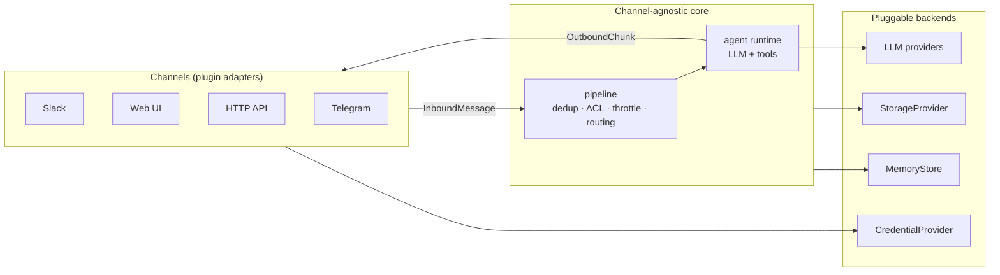

# nalbam-agent

**멀티테넌트 · 멀티채널 · 플러그인 확장형 AI 에이전트.**

하나의 배포가 다수 테넌트를 격리해 서빙하고, 입력·회신·도구·LLM·저장소를 플러그인으로
교체·추가하며, 채널 무관 코어가 모든 채널을 동일하게 처리한다.

- 목표 설계(계층·인터페이스·플러그인 프로토콜·실행 모델): [`docs/architecture.md`](./docs/architecture.md)
- 구현 목표(영역별 명세 + 순서): [`docs/roadmap.md`](./docs/roadmap.md)

> **현재 상태**: 목표의 첫 단계로 **Slack 채널**을 구현 중이다. 입력·회신·도구·자격증명이
> 아직 Slack에 결합되어 있으며, 이를 채널 무관 코어 + 어댑터로 일반화하는 것이 진행 방향이다.

## 목표 구조



채널 어댑터가 native 페이로드를 `InboundMessage`로 정규화하고, 코어는 채널을 모른 채 처리하며,
응답은 `Responder`가 채널 native 포맷으로 렌더링한다. 상세는 [`docs/architecture.md`](./docs/architecture.md).

## 기술 스택 (현재 구현)

- Node.js 22 · pnpm 11 · TypeScript `strict + noUncheckedIndexedAccess`
- Next.js 16 (App Router) · React 19
- Vercel AI SDK 6 (`@ai-sdk/openai` + `@ai-sdk/amazon-bedrock`)
- `@slack/web-api` (현재 채널)
- Better Auth (operator UI)
- DynamoDB 단일 테이블 + Redis/Valkey(KV)
- Tailwind v4 + shadcn/ui (`new-york`)
- Vitest

## 빠른 시작

현재 구현된 경로(Slack 채널 + operator UI)로 로컬 실행한다. AWS 자격증명이 로컬 체인
(`aws configure` / `aws sso login` / `AWS_PROFILE`)에 있어야 한다 — dev 서버가 실제 DynamoDB·SSM을 사용한다.

```bash
cp .env.example .env.local
# 최소: BETTER_AUTH_SECRET (openssl rand -base64 32), OPENAI_API_KEY,
#       AWS_REGION, DYNAMODB_TABLE_NAME

docker compose up -d         # Valkey (Better Auth secondaryStorage용 KV)
pnpm install
pnpm db:init                 # DynamoDB 테이블 + GSI1 + TTL 생성
pnpm dev                     # http://localhost:3000
```

Slack 앱 등록(현재 채널):

```bash
pnpm slack-apps register A0XXXXXXXXX   # signing_secret + bot_token 프롬프트(숨김 입력)
# 또는 operator 웹 UI: /signup 후 /slack/new
```

## 스크립트

| 명령 | 설명 |
|---|---|
| `pnpm dev` | Next.js dev 서버 |
| `pnpm build` / `start` | 프로덕션 빌드 / 실행 |
| `pnpm lint` / `typecheck` | ESLint / `tsc --noEmit` |
| `pnpm format` / `format:check` | Prettier |
| `pnpm test` / `test:watch` / `test:ui` | Vitest |
| `pnpm db:init` / `db:delete` | DynamoDB 테이블 생성 / 삭제 |
| `pnpm slack-apps` | operator CLI — `list / get / register / delete / acl / persona / name` |

## 프로젝트 레이아웃 (현재 구현)

```
src/
├── app/
│   ├── (auth)/                       operator UI 인증 (sign-up/in)
│   ├── (protected)/slack/            operator UI: list / register / edit / delete
│   ├── api/
│   │   ├── auth/[...all]             Better Auth handler
│   │   ├── slack/events              Slack receiver (verify + dedup + after())
│   │   ├── health                    헬스 프로브
│   │   └── csp-report                CSP 위반 수신
│   └── globals.css                   디자인 토큰
├── components/ui/                    shadcn primitives
├── lib/
│   ├── slack/                        현재 Slack 채널 구현 (verify/credentials/dedup/
│   │                                 conversation/stream/acl/agent/tools/handlers/…)
│   ├── llm/                          provider factory + vision
│   ├── auth/                         Better Auth + DynamoDB adapter + KV
│   ├── dynamodb*.ts                  단일 테이블 키/헬퍼
│   ├── env.ts                        zod 검증 env
│   └── logger.ts                     구조 로깅
├── instrumentation.ts                Next.js register() 훅
└── proxy.ts                          세션 쿠키 체크
scripts/                              db:init / db:delete / slack-apps / copy-fonts
```

## 환경 변수

전체 목록·기본값은 [`.env.example`](./.env.example). 부팅 최소값:

- `BETTER_AUTH_SECRET` (≥ 32자) — operator UI 세션
- `AWS_REGION`, `DYNAMODB_TABLE_NAME` — DynamoDB
- `OPENAI_API_KEY` — `LLM_PROVIDER=openai`(기본) 시 필수
- `SLACK_SSM_PREFIX` (기본 `/nalbam-agent/slack/apps`)

`src/lib/env.ts`가 모든 변수를 zod로 검증하고 실패 시 다중 줄 요약으로 fail-fast.

## 로드맵 & 아키텍처

- [`docs/roadmap.md`](./docs/roadmap.md) — 최종 목표를 향해 **구현해야 할 것**을 영역별로 명세.
- [`docs/architecture.md`](./docs/architecture.md) — 그 목표를 **어떻게** 만드는지의 설계 청사진.

## 라이선스

MIT — [`LICENSE`](./LICENSE) 참조.
