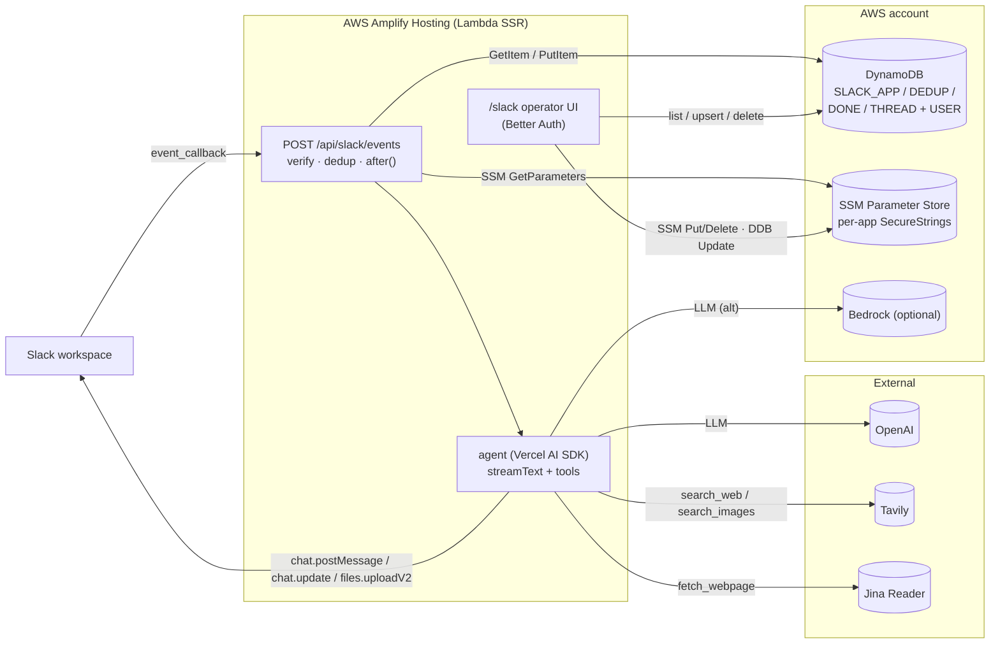

# nalbam-agent

A **multi-tenant Slack AI agent** built on Next.js 16 (App Router) + Better Auth + DynamoDB single-table + Vercel AI SDK, deployed to AWS Amplify Hosting (SSR).

One deployment serves arbitrarily many Slack apps. Each app's signing secret and bot token live as SSM SecureString parameters; per-app ACL and persona overrides live in DynamoDB alongside the agent's dedup, conversation history, and metadata rows. A built-in operator web UI (`/slack`, Better Auth-protected) and a CLI (`pnpm slack-apps`) wrap the same store helpers.

Ported from [`lambda-gurumi-bot`](https://github.com/nalbam/lambda-gurumi-bot) (Python + Serverless Framework + AWS Lambda) — see [`docs/slack-bot.md`](./docs/slack-bot.md) for the full architecture.

## Architecture



## Stack

- Node.js 22 · pnpm 11 · TypeScript `strict + noUncheckedIndexedAccess`
- Next.js 16 (App Router) · React 19
- Vercel AI SDK 6 with `@ai-sdk/openai` + `@ai-sdk/amazon-bedrock`
- `@slack/web-api` 7
- Better Auth 1.6 (operator UI session)
- DynamoDB single-table (PK/SK + GSI1 + TTL)
- AWS SSM Parameter Store for per-app secrets
- `unpdf` for PDF extraction
- Tailwind v4 + shadcn/ui (`new-york`)
- Vitest

## Quick start

You need AWS credentials configured locally (`aws configure` / `aws sso login` / `AWS_PROFILE`) — the dev server signs DynamoDB and SSM requests with the default credential chain.

```bash
cp .env.example .env.local
# At minimum: BETTER_AUTH_SECRET (openssl rand -base64 32), OPENAI_API_KEY,
# AWS_REGION, DYNAMODB_TABLE_NAME. The bot doesn't run without an LLM key.

docker compose up -d         # Valkey only (KV for Better Auth secondaryStorage)
pnpm install
pnpm db:init                 # creates the DynamoDB table + GSI1 + TTL
pnpm dev                     # http://localhost:3000
```

Then register your first Slack app:

```bash
# Via CLI (prompts for signing_secret + bot_token, hidden):
pnpm slack-apps register A0XXXXXXXXX

# Or via the operator web UI (Better Auth — sign up first):
open http://localhost:3000/signup
# then visit /slack/new after authenticating
```

The full Slack-side configuration (scopes, event subscriptions, `Request URL`) is documented in [`docs/slack-bot.md`](./docs/slack-bot.md).

## Scripts

| Command | Description |
|---|---|
| `pnpm dev` | Start the Next.js dev server |
| `pnpm build` | Production build |
| `pnpm start` | Run the production build |
| `pnpm lint` | ESLint |
| `pnpm typecheck` | `tsc --noEmit` |
| `pnpm format` / `format:check` | Prettier |
| `pnpm test` / `test:watch` / `test:ui` | Vitest |
| `pnpm db:init` | Create the application DynamoDB table + GSI1 + TTL (real AWS by default, or DynamoDB Local when `DYNAMODB_ENDPOINT` is set). Applies cloud-man tags. |
| `pnpm db:delete` | Delete the application table. Refuses tables missing the `ManagedBy=CloudManager` tag. |
| `pnpm slack-apps` | Operator CLI — `list / get / register / delete / acl / persona / name`. See [`docs/slack-bot.md`](./docs/slack-bot.md). |

## Project layout

```
src/
├── app/
│   ├── (auth)/                       sign-up + sign-in (operator UI auth)
│   ├── (protected)/
│   │   └── slack/                    operator UI: list / register / edit / delete
│   ├── api/
│   │   ├── auth/[...all]             Better Auth handler
│   │   ├── slack/events              Slack receiver — verify + dedup + after()
│   │   ├── health                    Amplify health probe
│   │   └── csp-report                CSP violation receiver
│   ├── layout.tsx · page.tsx
│   ├── error.tsx · not-found.tsx · loading.tsx
│   ├── manifest.ts · robots.ts · sitemap.ts · opengraph-image.tsx
│   └── globals.css                   Design tokens (@theme inline)
├── components/
│   ├── sign-out-button.tsx
│   └── ui/                           shadcn primitives
├── lib/
│   ├── slack/
│   │   ├── verify.ts                 HMAC + 5-min replay guard
│   │   ├── credentials.ts            SSM SecureString reader/writer + cache
│   │   ├── app-metadata.ts           DDB CRUD for SLACK_APP rows
│   │   ├── dedup.ts                  Two-stage idempotency (reserve + markDone)
│   │   ├── conversation.ts           Thread history with truncation
│   │   ├── formatter.ts              mrkdwn splitter + token redaction
│   │   ├── stream.ts                 Lazy placeholder + chat.update throttle
│   │   ├── client.ts                 Per-app WebClient cache
│   │   ├── user-name-cache.ts        Display-name cache + parallel warm
│   │   ├── acl.ts                    Channel/user allowlist (env + per-app)
│   │   ├── system-prompt.ts          5-layer prompt assembly
│   │   ├── router.ts                 event dispatch (mention/DM/reaction)
│   │   ├── agent.ts                  streamText wrapper
│   │   ├── handlers/                 message + reactions
│   │   └── tools/                    time / web / search / slack-tools / image
│   ├── llm/
│   │   ├── factory.ts                openai + bedrock provider selection
│   │   └── vision.ts                 describeImage helper (multimodal)
│   ├── auth/                         Better Auth + DynamoDB adapter + KV
│   ├── auth.ts · auth-client.ts
│   ├── dynamodb.ts                   keys / gsi1 / validateId / sanitizeKeyValue
│   ├── dynamodb-helpers.ts           thin DocumentClient wrappers
│   ├── email.ts                      AWS SES sender (lazy)
│   ├── env.ts                        zod-validated server/client env
│   ├── logger.ts                     Structured JSON logger
│   └── safe-redirect.ts              ?redirect= open-redirect guard
├── instrumentation.ts                Next.js register() hook
└── proxy.ts                          Cheap session-cookie check
scripts/
├── init-dynamodb.ts / delete-dynamodb.ts
├── slack-apps.ts                     Operator CLI
└── copy-fonts.mjs                    Postinstall: Pretendard
```

## Environment variables

Documented exhaustively in [`.env.example`](./.env.example). Minimum to boot the bot:

- `BETTER_AUTH_SECRET` (≥ 32 chars) — operator-UI session secret
- `AWS_REGION`, `DYNAMODB_TABLE_NAME` — DynamoDB target
- `OPENAI_API_KEY` — required when `LLM_PROVIDER=openai` (default)
- `SLACK_SSM_PREFIX` (defaults to `/nalbam-agent/slack/apps`)

Useful additions:

- `LLM_PROVIDER` / `LLM_MODEL` (`openai` default; `bedrock` requires the IAM statement in [`docs/amplify-deploy.md`](./docs/amplify-deploy.md))
- `IMAGE_PROVIDER` / `IMAGE_MODEL` (image generation is OpenAI-only)
- `TAVILY_API_KEY` — enables Tavily for web/image search (otherwise DDG fallback for `search_web`, error for `search_images`)
- `ALLOWED_CHANNEL_IDS` / `ALLOWED_USER_IDS` — global allowlists (CSV). Per-app overrides via the `/slack/[appId]` UI take precedence.
- `SYSTEM_MESSAGE` (global only) / `PERSONA_MESSAGE` (per-app override available)

`src/lib/env.ts` validates every variable with zod and fails fast with a multi-line summary.

## DynamoDB schema

Full key map in [`docs/dynamodb-schema.md`](./docs/dynamodb-schema.md). Highlights:

- One table for Better Auth (`USER#`, `SESSION#`, `ACCOUNT#`, `VERIFICATION#`) AND the Slack agent (`SLACK_APP#`, `SLACK_DEDUP#`, `SLACK_DONE#`, `SLACK_THREAD#`).
- Single `GSI1` covers email lookup (auth) and team-id lookup (Slack apps).
- TTL on `ttl`: Better Auth sessions, verification tokens, Slack dedup rows (5 min) and thread history (1 h).

## Deploying to AWS Amplify

[`docs/amplify-deploy.md`](./docs/amplify-deploy.md) has the complete guide including the IAM policy (DynamoDB + SSM + optional Bedrock + optional SES) and the full env-var table. The first thing to verify on a fresh deploy is that **Next.js 16's `after()` callback runs to completion on Amplify SSR** — it's the load-bearing primitive the agent design depends on: the route returns 200 immediately and the agent keeps streaming from the deferred callback. The verification steps are in [`docs/slack-bot.md`](./docs/slack-bot.md#verifying-after-works-on-your-amplify-deployment).

## Operations

See [`docs/runbook.md`](./docs/runbook.md) for cold-start scenarios: provisioning a fresh table, registering a Slack app, rotating signing secrets, ACL/persona changes, `:x:` reactions, and Amplify build troubleshooting.

## Testing

- Unit tests next to source files (`*.test.ts`) — 152 passing.
- Integration tests use the `*.integration.test.ts` suffix and run against DynamoDB Local (start with `docker compose --profile test up -d`). Each test calls `if (!available) return;` so missing DDB Local just no-ops.

## License

MIT — see [`LICENSE`](./LICENSE).
