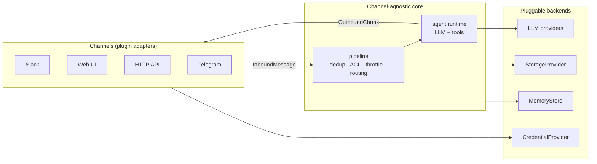

# nalbam-agent

**멀티테넌트 · 멀티채널 · 플러그인 확장형 AI 에이전트.**

하나의 배포가 다수 테넌트를 격리해 서빙하고, 입력·회신·도구·LLM·저장소를 플러그인으로
교체·추가하며, 채널 무관 코어가 모든 채널을 동일하게 처리한다.

- 목표 설계(계층·인터페이스·플러그인 프로토콜·실행 모델): [`docs/architecture.md`](./docs/architecture.md)
- 구현 목표(영역별 명세 + 순서): [`docs/roadmap.md`](./docs/roadmap.md)

> **현재 상태**: 이 설계를 향한 **그린필드 골격**이다. 정규화 타입, 채널/도구/provider 레지스트리,
> 코어 파이프라인, Better Auth, DynamoDB 기반 공통 인프라는 존재하지만 실제 에이전트 응답 경로는 아직
> 스텁이다. Slack은 첫 채널 어댑터이되 `ingest`/responder/capability/credentials 구현이 남아 있다.
> [`docs/roadmap.md`](./docs/roadmap.md)의 "MVP 수용 기준"과 "구현 순서"대로 코어를 채워간다.

## 제품 원칙

- **Tenant isolation first** — 모든 저장소 키, rate limit, dedup, 메모리, 자격증명은
  `{channel}:{tenantId}` 스코프를 가진다.
- **One core, many transports** — webhook, HTTP, connection 채널은 같은 `runConversation`을 호출한다.
- **Capabilities over channel checks** — 도구는 Slack/Telegram 같은 채널명을 보지 않고 `Capabilities`만 본다.
- **Plugins at the edge** — 새 채널·도구·LLM provider·저장소 추가는 인터페이스 구현과 등록으로 끝나야 한다.
- **Secure by default** — 채널 검증, replay guard, allowlist, SSRF 방어, 시크릿 격리는 필수 기능이다.

## 목표 구조



채널 어댑터가 native 페이로드를 `InboundMessage`로 정규화하고, 코어는 채널을 모른 채 처리하며,
응답은 `Responder`가 채널 native 포맷으로 렌더링한다. 상세는 [`docs/architecture.md`](./docs/architecture.md).

## 기술 스택

- Node.js 22 · pnpm 11 · TypeScript `strict + noUncheckedIndexedAccess`
- Next.js 16 (App Router) · React 19
- Vercel AI SDK 6 (`@ai-sdk/openai` + `@ai-sdk/amazon-bedrock`)
- Better Auth (operator UI) · DynamoDB 단일 테이블 + Redis/Valkey(KV)
- Tailwind v4 + shadcn/ui (`new-york`) · Vitest
- `@slack/web-api` · `unpdf` · `@aws-sdk/client-ssm` — Slack 채널·문서 도구·자격증명 구현(예정)용으로 의존성에 포함

## 빠른 시작

현재는 **골격 단계**다 — 인터페이스와 스텁으로 `typecheck`·`build`·`test`가 통과하지만 에이전트는
아직 동작하지 않는다(전 경로 스텁). 로컬 실행 시 AWS 자격증명이 로컬 체인
(`aws configure` / `aws sso login` / `AWS_PROFILE`)에 있어야 한다 — dev 서버가 실제 DynamoDB를 사용한다.

```bash
cp .env.example .env.local
# 최소: BETTER_AUTH_SECRET (openssl rand -base64 32), AWS_REGION, DYNAMODB_TABLE_NAME
#       (OPENAI_API_KEY는 LLM provider 사용 시)

docker compose up -d         # Valkey (Better Auth secondaryStorage용 KV)
pnpm install
pnpm db:init                 # DynamoDB 테이블 + GSI1 + TTL 생성
pnpm dev                     # http://localhost:3000
```

채널 어댑터·도구·메모리·저장소는 구현 예정 — [`docs/roadmap.md`](./docs/roadmap.md) "구현 순서" 참고.

## 스크립트

| 명령 | 설명 |
|---|---|
| `pnpm dev` | Next.js dev 서버 |
| `pnpm build` / `start` | 프로덕션 빌드 / 실행 |
| `pnpm lint` / `typecheck` | ESLint / `tsc --noEmit` |
| `pnpm format` / `format:check` | Prettier |
| `pnpm test` / `test:watch` / `test:ui` | Vitest |
| `pnpm db:init` / `db:delete` | DynamoDB 테이블 생성 / 삭제 |

## 프로젝트 레이아웃 (골격)

```
src/
├── core/              도메인 모델 · runConversation 파이프라인 · dedup/acl/throttle 계약 · deps
├── channels/          ChannelAdapter 레지스트리 + slack/ (스텁)
├── agent/             runtime(스텁) · system-prompt · providers/(openai·bedrock) · tools/
├── storage/           StorageProvider(kv+doc) + memory-kv
├── memory/            MemoryStore (단기·장기·검색)
├── credentials/       CredentialProvider
├── observability/     요청 스코프 로거
├── worker/            connection 모드 worker (스텁)
├── app/
│   ├── (auth)/                    operator UI 인증 (sign-up/in)
│   ├── (protected)/               보호 레이아웃 (operator UI 예정)
│   ├── api/channels/[channel]     통합 채널 ingress (webhook/http)
│   ├── api/auth · health · csp-report
│   └── globals.css                디자인 토큰
├── components/ui/                 shadcn primitives
├── lib/                           재사용 인프라 (env · logger · dynamodb · auth · email)
├── instrumentation.ts             Next.js register() 훅
└── proxy.ts                       세션 쿠키 체크
scripts/                           db:init / db:delete / copy-fonts
```

## 환경 변수

전체 목록·기본값은 [`.env.example`](./.env.example). 부팅 최소값:

- `BETTER_AUTH_SECRET` (≥ 32자) — operator UI 세션
- `AWS_REGION`, `DYNAMODB_TABLE_NAME` — DynamoDB
- `OPENAI_API_KEY` — `LLM_PROVIDER=openai`(기본) 시 필수

`src/lib/env.ts`가 모든 변수를 zod로 검증하고 실패 시 다중 줄 요약으로 fail-fast.

## 로드맵 & 아키텍처

- [`docs/roadmap.md`](./docs/roadmap.md) — 최종 목표를 향해 **구현해야 할 것**을 영역별로 명세.
- [`docs/architecture.md`](./docs/architecture.md) — 그 목표를 **어떻게** 만드는지의 설계 청사진.

## 현재 MVP 기준

첫 운영 가능한 단위는 "Slack webhook 한 채널이 실제 LLM 응답을 안전하게 스트리밍/최종 회신하고, 같은
코어로 HTTP API 채널을 추가해도 코어 변경이 없는 상태"다. 이 기준을 만족하기 전까지 외부 npm 플러그인
discovery, 검색 메모리, 이미지 편집 같은 확장 기능은 후순위다.

## 라이선스

MIT — [`LICENSE`](./LICENSE) 참조.
